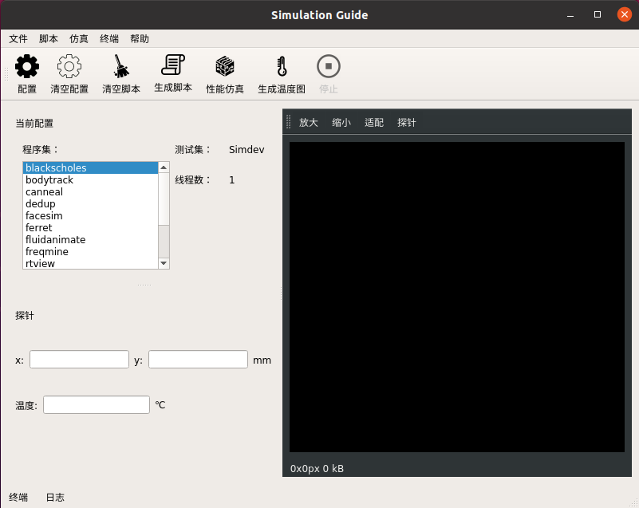

# 微处理器热特性仿真向导软件

## 一、项目简介
本软件基于现有的微处理器热特性仿真流程，提供图形化界面，旨在简化仿真流程，提供友好的用户体验，目前已经部署在Ubuntu16.04.7LTS系统。



## 二、软件功能
**1. 配置性能仿真**

* 选择菜单栏的脚本-配置菜单或工具栏的配置按钮，将弹出配置对话框。在配置对话框的引导下，用户可以依次选择性能仿真的架构、指令集、基准程序、测试集和线程数。

* 选择菜单栏的脚本-清除配置菜单或工具栏的清除配置按钮，将清除已有配置。

**2. 生成性能仿真脚本**

* 选择菜单栏的脚本-生成脚本菜单或工具栏的生成脚本按钮，将根据当前配置，在目录TR-09-32-parsec-2.1-alpha-files下生成脚本。当用户未配置时，无法生成脚本。每次生成脚本时，会删除旧的脚本。

* 选择菜单栏的脚本-清空脚本菜单或工具栏的清空脚本按钮，将删除所有脚本。

**3. 性能仿真**

* 选择菜单栏的仿真-性能仿真菜单或工具栏的性能仿真按钮，将调用gem5模块进行性能仿真。性能仿真过程基于用户配置和生成的脚本，因此，进行性能仿真前必须先配置并生成脚本。性能仿真耗时较长，仿真结果位于目录gem5_output下，供用户查看和其他功能使用。

**4. 生成温度图**
  
* 选择菜单栏的仿真-生成温度图菜单或工具栏的生成温度图按钮，软件将通过一系列流程，将gem5输出的性能数据先转换为功耗数据，再将功耗数据转换为温度数据，最终绘制出温度分布图。温度图位于HeatMap目录，点击配置窗口的基准程序名，将显示对应的温度图。

**5. 温度场探针**

* 在配置窗口选择了基准程序并显示出温度图后，选择温度图的探针按钮，在温度图的温度分布范围内任意位置点击，探针窗口将显示点击位置的坐标和温度。

## 三、项目部署
**1. 直接运行二进制文件**
```bash
#安装依赖
sudo apt update
sudo apt upgrade
sudo apt install wget tar

#下载压缩包并解压
wget https://github.com/creeper12356/guide_software/releases/download/v2.1.0-alpha/release_2.1.0.tar.gz
wget https://github.com/creeper12356/guide_software/releases/download/v2.0.0-alpha/modules.tar.gz
tar -zxvf release_2.1.0.tar.gz
tar -zxvf modules.tar.gz
cp modules/* release_2.1.0/ -r

#运行项目
cd release_2.1.0/
./guide_software
```
**2. 从源代码编译（Ubuntu16.04环境）**
```bash
#安装依赖
sudo apt update
sudo apt upgrade
sudo apt install qt5-default git wget tar

#克隆仓库
git clone https://github.com/creeper12356/guide_software

#加入模块
wget https://github.com/creeper12356/guide_software/releases/download/v2.0.0-alpha/modules.tar.gz
tar -zxvf modules.tar.gz
cp modules/* guide_software/experiment/ -r

#构建和编译
mkdir guide_software/experiment/build
cd guide_software/experiment/build
qmake ../src/guide_software.pro -spec linux-g++ CONFIG+=debug
make -f Makefile qmake_all
make

#运行项目
./guide_software

```

## 四、软件的后续开发工作
软件目前存在很多不足之处，包括但不限于：
* 由于gem5性能仿真的耗时较长，开发者并未完整测试过软件是否能正常进行仿真，希望用户能够帮助测试。
* 软件在温度场探针功能上，对用户点击坐标到坐标轴坐标的转换进行了硬编码，可移植性较差。后续改进方式：调用matplotlib库的坐标转换接口。
* 当前仿真所用的操作系统Ubuntu16.04和脚本语言Python2已经停止维护，为了该项目的可持续性，开发者曾经尝试将项目迁移到Ubuntu20.04，但由于Python脚本和gem5模块的兼容性问题未能完全迁移成功。后续改进方式：兼容高版本的Ubuntu，同时使用获得支持的Python3 。
* 由于开发者经验不足，部分代码和文档不甚清晰，敬请谅解。

## 五、用户反馈
[https://github.com/creeper12356/guide_software/issues](https://github.com/creeper12356/guide_software/issues)
