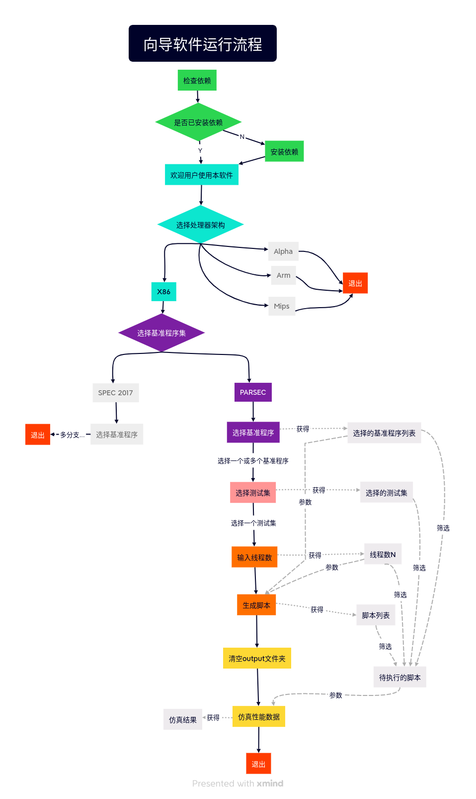

# 向导软件开发方案

 黄峻涛

## 软件运行步骤
软件运行分为三步：
1. 引导用户输入微处理器信息，仿真得到微处理器的**性能数据**。
2. 根据微处理器的**性能数据**，仿真得到**功耗数据**。
3. 引导用户输入微处理器中热传感器的位置，根据**性能数据**仿真得到**温度数据**。
---
## 细分基本流程
由于第一步最简单，现在先完成第一步的开发。将第一步细分：
* 1.1 安装前置软件
* 1.2 选择处理器架构
* 1.3 选择基本程序集
* 1.4 选择测试集
* 1.5 输入线程数并生成脚本
* 1.6 仿真性能数据
根据细分的流程，画出程序运行的流程图：
</img>
在流程图中，不同的细分步骤使用不同的颜色表示，未实现的部分使用灰色，出口使用红色。\
流程图中的箭头有两种，实线表示流程的转换，虚线表示数据的输入和输出。

## 具体开发计划
目前计划将软件分为四个模块进行开发:
* 1.1 **依赖安装 DependencyInstaller**
    * 软件启动时，首先读取配置文件config.json文件中的IsDependencyInstalled字段：
        * 如果为true，则直接进入软件主页面。
        * 如果为false（这通常出现在首次启动软件的时候），DependencyInstaller将检查当前环境中的所有前置软件。
            * 如果所有前置软件都已经安装，将config.json中isDependencyInstalled字段修改为true，进入主页面。
            * 如果有前置软件没有安装，则弹出一个对话框，展示所有未安装的前置软件的列表,并询问用户是否安装。安装完成后，将config.json中isDependencyInstalled修改为true，进入主页面。
* 1.2 **选择引导 ChoiceGuide**
    * 一个类似安装程序的引导页面，引导用户一步步选择架构，基本程序集，测试集，线程数，支持用户回溯选择。
* 1.3 **软件主页面 HomePage**
    * 软件GUI的主要部分，目前大致包含几个部分：
        * 配置按钮(Configure)，按下后将启动ChoiceGuide，一步步引导用户选择架构，基本程序集，测试集，线程数，用户选择完毕后回到主页面
        * 生成脚本(Generate),按下后根据用户的配置生成脚本，如果用户还未配置，发出一条警告，引导用户进行配置。
        * 仿真(Simulate)，根据用户的配置，运行生成的脚本，将仿真结果输出到对应文件夹。
* 1.4 **软件管理内核 Core**
    * 本身不具有图形界面，控制页面跳转逻辑关系和进程通信。
---
目前安排（临时计划，可能发生变动）\
**11.9-11.15** 完成DependencyInstaller和HomePage的GUI;\
**11.16-11.22** 完成ChoiceGuide;\
**11.23-11.30** 完成Core和页面之间的逻辑关系。
